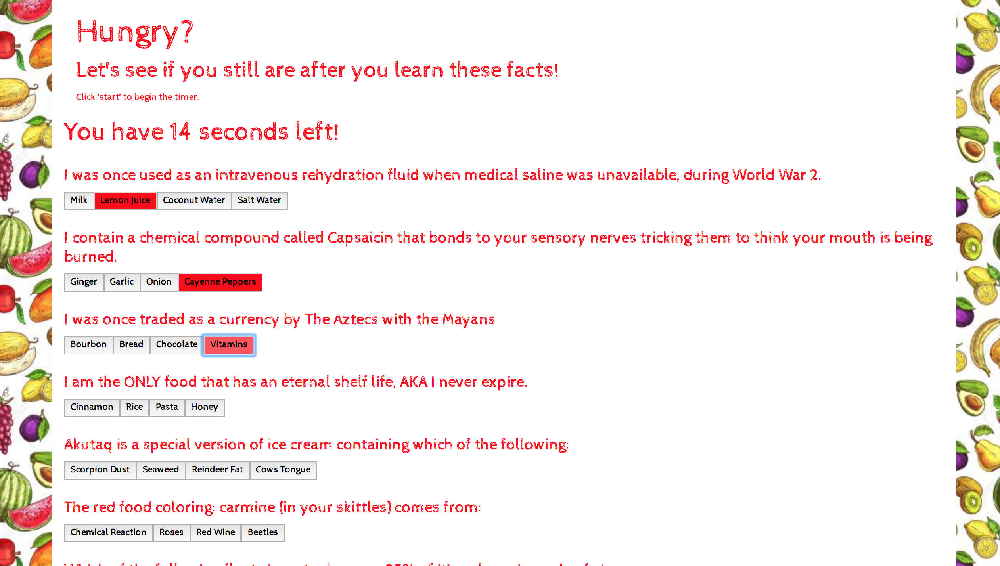

# TriviaGame
Trivia Game - Week 3

Welcome to Trivia! 
This game is based around food, there are 10 questions in total with 60 seconds on the clock to answer them all to your best of knowledge. Are you up for the challenge? Click the start button to begin the count down. Once you have finished answering all the questions click the finish button to find out your score.

// Psuedocode notes put throughout to understand functionality of specific areas of code. //

<a href="https://blonded.github.io/TriviaGame/" alt="DEMO"> "DEMO" </a>

Installing
Download repository on GitHub, open in preferred text editor to view source code (i.e. Atom, Sublime, Visual Studio Code). Open index.html, style.css, and app.js. Right click on the html file code and select "view in default browser" to view a demo of the website created. (Google Chrome Preferred for viewing)

index.html
style.css
app.js
javascript  /folder
css         /folder
assets      /folder
images      /folder
LICENSE
README.md

Sample of code used:

JavaScript Shown: 
This code is a function to run through the values taken to decipher what your final score is on the test.
Add it up into it's individual groups of Right or Wrong.

''''''
//this tests if the answers were wrong or right and displays the right vs wrong / score
function logic (){
  console.log("test")
 for(var i = 0; i< trivia.length;i++){
   if(trivia[i].correct === answers[i]){
     correct++;
     console.log("right",correct)
   }else {
     wrong++;
     console.log("wrong",wrong)
   }
 }
}
   

'''''

## Built With

* [html]
* [css]
* [javascript]
* [jQuery]
* [bootstrap]

## Authors

* **Lena Martinson** - *Github* - [Github](https://github.com/Blonded)
* **Google Fonts** - *GoogleFonts* - [Google Fonts](https://fonts.google.com/)
* **BootStrap** - *Bootstrap* - [BootStrap](https://getbootstrap.com/)

